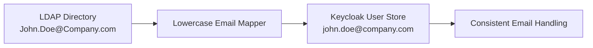

# Keycloak LDAP Lowercase Email Mapper

[](https://opensource.org/licenses/MIT)
[](https://www.oracle.com/java/)
[](https://www.keycloak.org/)

A Keycloak LDAP Storage Mapper SPI that automatically converts email addresses from LDAP to lowercase during user import, ensuring consistent email handling and preventing unnecessary profile update prompts.

## Overview

When integrating Keycloak with LDAP, email addresses are often stored in mixed case in the LDAP directory (e.g., `John.Doe@Company.com`). However, Keycloak internally normalizes emails to lowercase. This mismatch can cause:

- Repeated profile update prompts for users
- Inconsistent email matching behavior
- User experience issues during authentication flows

This mapper solves these issues by automatically converting LDAP email attributes to lowercase during the import process.

## Features

- **Automatic email normalization**: Converts LDAP `mail` attribute to lowercase
- **Zero configuration**: No additional setup required after installation
- **Keycloak 26.x compatible**: Built and tested with the latest Keycloak version
- **Lightweight**: Minimal performance impact
- **Standards compliant**: Uses `Locale.ROOT` for consistent case conversion

## Quick Start

### Prerequisites

- Java 21 or higher
- Maven 3.6+
- Keycloak 26.x

### Installation

1. **Clone and build the project:**
   ```bash
   git clone <repository-url>
   cd ldap-lowercase-email-mapper
   mvn clean package
   ```

2. **Deploy to Keycloak:**
   ```bash
   cp target/ldap-lowercase-email-mapper-1.0.0.jar /opt/keycloak/providers/
   ```

3. **Restart Keycloak:**
   ```bash
   /opt/keycloak/bin/kc.sh start
   ```

### Configuration

1. Navigate to the Keycloak Admin Console
2. Go to **User Federation** → Select your **LDAP provider**  
3. Switch to the **Mappers** tab
4. Click **Add mapper**
5. Select **Lowercase Email Mapper** from the mapper type dropdown
6. Configure the mapper:
   - **Name**: `lowercase-email`
   - **LDAP Attribute**: `mail`
   - **User Model Attribute**: `email`
7. Save the configuration
8. Run a **Full Sync** to apply the mapper to existing users

## How It Works



1. **LDAP Query**: Keycloak queries LDAP and retrieves user data
2. **Email Processing**: The mapper intercepts the `mail` attribute
3. **Case Conversion**: Email is converted to lowercase using `Locale.ROOT`
4. **User Import**: Normalized email is stored in Keycloak's user database
5. **Consistency**: Future syncs maintain the lowercase format

## Project Structure

```
ldap-lowercase-email-mapper/
├── src/main/java/com/example/keycloak/
│   ├── LowercaseEmailMapper.java          # Main mapper implementation
│   └── LowercaseEmailMapperFactory.java   # Mapper factory for Keycloak SPI
├── src/main/resources/META-INF/services/
│   └── org.keycloak.storage.ldap.LDAPStorageMapper  # SPI registration
├── pom.xml                                # Maven configuration
├── README.md                              # This file
└── LICENSE                                # MIT license
```

## Development

### Building from Source

```bash
# Clone the repository
git clone <repository-url>
cd ldap-lowercase-email-mapper

# Compile and package
mvn clean compile
mvn package

# Run tests (if available)
mvn test
```

### Code Quality

The project follows standard Java conventions:
- Full JavaDoc documentation
- Clean code principles
- Minimal dependencies
- Exception safety

## Testing

To test the mapper:

1. Set up an LDAP directory with mixed-case email addresses
2. Configure Keycloak LDAP federation with this mapper
3. Perform user synchronization
4. Verify emails are stored in lowercase in Keycloak
5. Check that subsequent syncs don't trigger profile updates

### Development Guidelines

1. Maintain compatibility with Keycloak 26.x
2. Include appropriate JavaDoc comments
3. Follow existing code style
4. Test your changes thoroughly

## Requirements

- **Keycloak**: 26.0.0 or later
- **Java**: 21 or higher
- **Maven**: 3.6.0 or higher

## License

This project is licensed under the MIT License - see the [LICENSE](LICENSE) file for details.

## Support

If you encounter any issues or have questions:

1. Check the [Issues](../../issues) section
2. Create a new issue with detailed information about your problem
3. Include Keycloak version, Java version, and error logs

## Related Resources

- [Keycloak Documentation](https://www.keycloak.org/documentation)
- [Keycloak LDAP Integration Guide](https://www.keycloak.org/docs/latest/server_admin/#_ldap)
- [Keycloak SPI Development](https://www.keycloak.org/docs/latest/server_development/)
